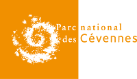

# Porté à connaissance des périmètres de quiétude

Outil de consultation des données relatives aux périmètres de quiétude du Parc National des Cévennes. Cet outil est à destination des collectivités ayant adhérées à la charte.

Les deux objectifs de ce porté à connaissance sont de permettre aux élus locaux référents de: 
- prendre en compte ces périmètres de quiétude dans l’élaboration de la règlementation circulation communale, 
- de contacter l’établissement s’ils ont connaissance d’un projet qui concerne un périmètre de quiétude. Ce contact permettra d’instaurer un dialogue entre porteur de projet et Parc pour concilier au mieux enjeux de protection et réalisation du projet.

Technologies
------------

- Langages : Python, HTML, JS, CSS
- BDD : PostgreSQL, PostGIS
- Serveur : Debian ou Ubuntu
- Framework Python : Flask
- Framework JS : AngularJs
- Framework carto : Leaflet

Architecture
------------


Installation
------------
### Prérequis 

Python3, Bower, Apache, Supervisor

```
# Installation de bower
npm install -g bower
```

### Backend
```
python3 -m venv venv
source venv/bin/activate
pip install -r requirements.txt 
```

### Frontend
```
cd static/
bower install
```

### Configuration
```
cp config/settings.ini.sample config/settings.ini
cp config/config.py.sample config/config.py
cp static/data/maps.json.sample static/data/maps.json
```

### Mise en place du service

sudo cp pacpq-service.conf /etc/supervisor/conf.d/
sudo sed -i "s%APP_PATH%`pwd`%" /etc/supervisor/conf.d/pacpq-service.conf
sudo supervisorctl reread
sudo supervisorctl reload
### Configuration apache

```
# activate proxy apache extension
sudo a2enmod proxy
sudo a2enmod proxy_http
```


```
#Configucation fichier apache
<VirtualHost *:80>

    # Configuration Geonature-atlas
    RewriteEngine  on
    <Location />
        ProxyPass  http://127.0.0.1:8283/
        ProxyPassReverse  http://127.0.0.1:8283/
    </Location>

    <Directory MY_PATH/porteconnaissance_pq>
      Order allow,deny
      Allow from all
      Require all granted
    </Directory>

</VirtualHost>
```
API
------------
  - Documentation sur les routes : [api](docs/api.md)

License
-------

* OpenSource - GPL V3
* Copyleft 2016 - Parc national des Cévennes




